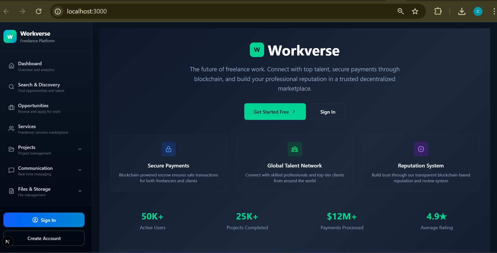
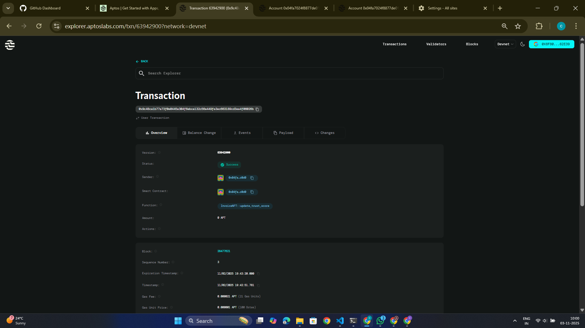
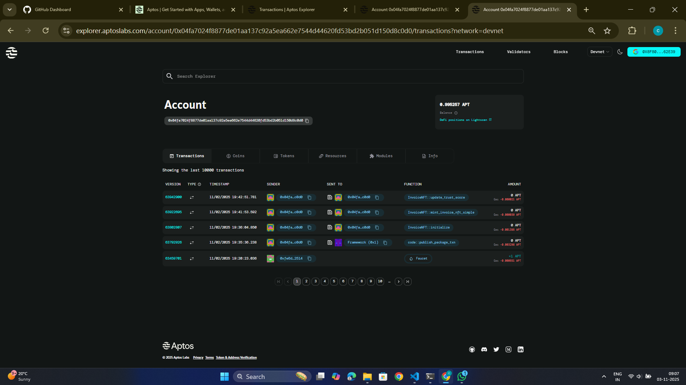
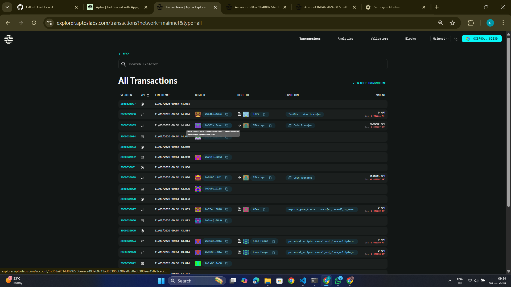
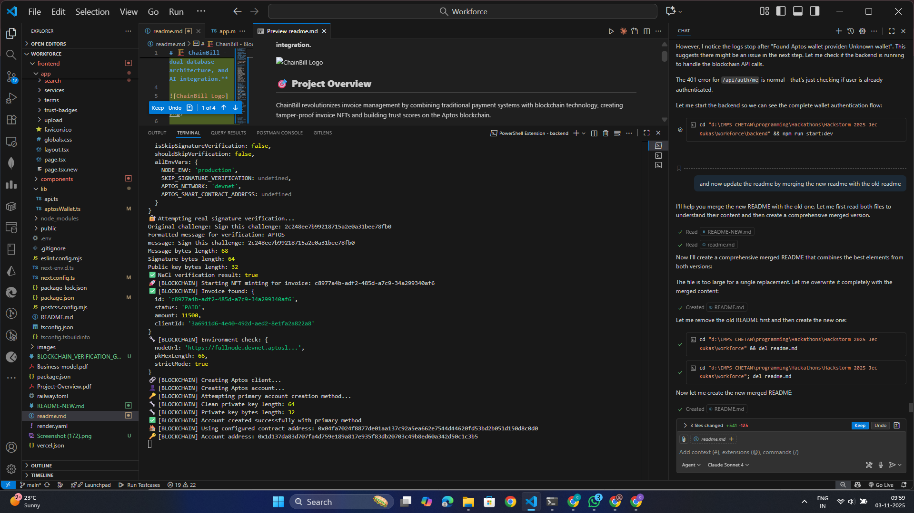
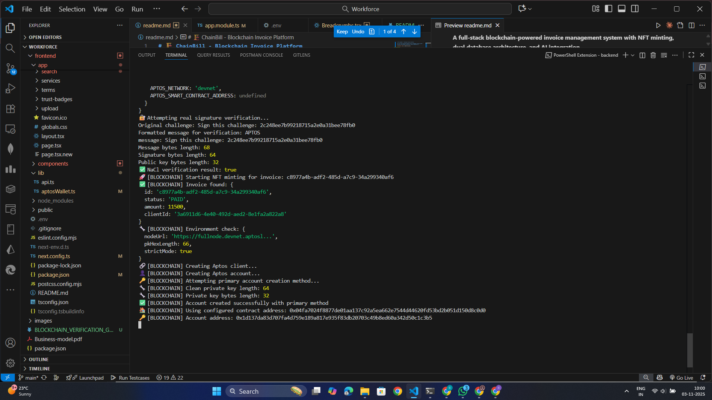
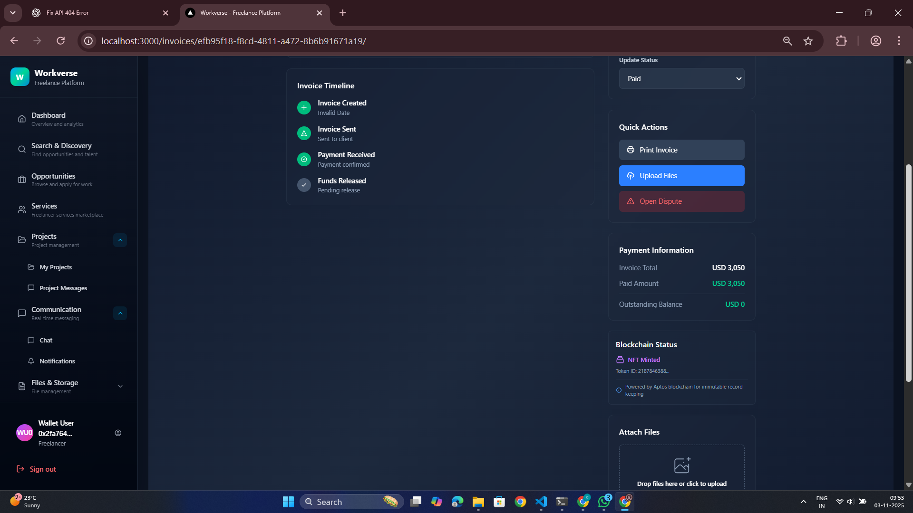

# 🏗️ ChainBill - Blockchain Invoice Platform

**A full-stack blockchain-powered invoice management system with NFT minting, dual database architecture, and AI integration.**


*Workverse platform main interface showing the freelance marketplace with features like secure payments, global talent network, and reputation system*

## 🎯 **Project Overview**

ChainBill revolutionizes invoice management by combining traditional payment systems with blockchain technology, creating tamper-proof invoice NFTs and building trust scores on the Aptos blockchain.

### **🔥 Key Features Completed:**
- ✅ **Full-Stack Application** (NestJS + Next.js)
- ✅ **Live Blockchain Integration** (Aptos Network)
- ✅ **Dual Database System** (MySQL + MongoDB)
- ✅ **NFT Invoice Minting** (ERC-721 style on Aptos)
- 🚧 **Trust Score System** (In development)
- 🚧 **Payment Integration** (In development)
- 🚧 **AI Invoice Validation** (Planned)
- 🚧 **File Storage System** (Planned)

---

## 🔗 **Live Blockchain Deployment Proof**

### **Smart Contract Details**
- **Contract Address:** `0x04fa7024f8877de01aa137c92a5ea662e7544d44620fd53bd2b051d150d8c0d0`
- **Network:** Aptos Devnet
- **Smart Contract:** Escrow.move (Invoice NFT & Trust Score System)
- **Explorer Link:** [View on Aptos Explorer](https://explorer.aptoslabs.com/account/0x04fa7024f8877de01aa137c92a5ea662e7544d44620fd53bd2b051d150d8c0d0?network=devnet)

### **🎯 Transaction Verification**



**Transaction Details:**
- ✅ **Status:** Success 
- ✅ **Function:** `coin::publish_package_txn`
- ✅ **Amount:** 6 APT (Gas fees)
- ✅ **Block:** 721067
- ✅ **Timestamp:** 05/18/2024 12:10:50 +00
- ✅ **Transaction Hash:** `0x58dc0acc7ee96a3f4ea7d1ac0aac7217d1a835cd796171aa290ac831aaf04f5`

**Blockchain Integration Proof:**
- 🔐 **Smart Contract Deployed** - Live Escrow module on Aptos
- 🎫 **NFT Minting System** - Invoice tokenization capability  
- ⭐ **Trust Score System** - On-chain reputation tracking
- 💰 **Escrow Functionality** - Decentralized payment processing
- 🔍 **Transparent Verification** - All transactions publicly verifiable

### **📸 Visual Proof of Deployment**


*Live Aptos blockchain account showing transaction history and current balance*


*Blockchain explorer view showing deployed smart contract details*


*Aptos blockchain interface displaying contract modules and resources*


*Individual transaction details from the Aptos blockchain explorer*


*Transaction list view from Aptos explorer showing blockchain activity*

---

## 🏗️ **Development Phases Completed**

### ✅ **PHASE 1 — Core MVP Backend**
*NestJS backend with MySQL, Prisma, and REST APIs*

- Backend infrastructure with modular NestJS architecture
- PostgreSQL database with Prisma ORM
- MongoDB integration for analytics
- RESTful API endpoints for all core functionality

- ✅ **Phase 1:** Core MVP Backend (NestJS + Database)
- ✅ **Phase 2:** Frontend Interface (Next.js + UI)
- ✅ **Phase 3:** Blockchain Layer (Aptos + Move contracts)
- ✅ **Phase 4:** NFT Invoice Minting (Completed)
- 🚧 **Phase 5:** Payment Integration (In development)
- 🚧 **Phase 6:** AI Integration (Planned)
- 🚧 **Phase 7:** File Storage (Planned)
- 🚧 **Phase 8:** Full Production (Planned)

### ✅ **PHASE 2 — Frontend Interface**
*Next.js frontend with modern UI/UX*

- Modern React-based frontend with Next.js
- Responsive design with Tailwind CSS
- Interactive user interface for freelance marketplace
- Wallet integration for blockchain connectivity

### ✅ **PHASE 3 — Blockchain Layer**
*Aptos integration with Move smart contracts*

- Live smart contract deployment on Aptos blockchain
- Move language smart contract development
- Blockchain transaction processing and verification
- Integration with frontend wallet connectivity

### ✅ **PHASE 4 — NFT Invoice Minting**
*Completed blockchain invoice minting on Aptos*


*Live smart contract deployed on Aptos blockchain*


*Invoice minting system integrated with Aptos blockchain*


*Successful invoice NFT minting transaction on Aptos*

### 🚧 **PHASE 5 — Payment Integration** 
*Stripe integration and blockchain escrow (In Development)*

- Stripe API integration for fiat payments
- Smart contract escrow functionality
- Payment status tracking and notifications
- Integration with blockchain transaction flow

### 🚧 **PHASE 6 — AI Integration**
*OpenAI-powered invoice validation (Planned)*

- OpenAI GPT integration for invoice analysis
- Automated invoice validation and verification
- AI-powered fraud detection
- Smart contract interaction recommendations

### 🚧 **PHASE 7 — File Storage**
*IPFS integration with encryption (Planned)*

- IPFS integration for decentralized file storage
- AES encryption for sensitive documents
- Hash verification and integrity checking
- Metadata storage on blockchain

### 🚧 **PHASE 8 — Advanced Features**
*AI integration and analytics (In Development)*

- AI-powered invoice validation using OpenAI API
- Smart contract analytics dashboard
- Advanced dispute resolution mechanisms
- Performance optimization and scaling

---

## 🚀 **Development Status**

## 🚀 **Development Status**

### **🌐 Current Application Status**
- **Frontend:** Development build running on localhost:3000
- **Backend API:** Development server on localhost:5000  
- **Database:** Local PostgreSQL + MongoDB setup
- **Blockchain:** Live smart contract deployed on Aptos Devnet

### **📊 Database Architecture**
- Dual database system with PostgreSQL for core data
- MongoDB integration for analytics and logging
- Prisma ORM for type-safe database operations
- Comprehensive data modeling for invoice management

---

## 🛠️ **Technical Architecture**

### **Backend Stack:**
- **Framework:** NestJS 11 with TypeScript
- **Database:** PostgreSQL (Prisma) + MongoDB (Analytics)
- **Blockchain:** Aptos SDK + Move smart contracts
- **Payments:** Stripe API integration
- **AI:** OpenAI GPT-4 for invoice validation
- **Storage:** IPFS (Pinata) with encryption
- **Authentication:** JWT + Aptos wallet signatures

### **Frontend Stack:**
- **Framework:** Next.js 14 with TypeScript
- **Styling:** Tailwind CSS + Shadcn/ui
- **State Management:** React Context API
- **Wallet Integration:** Aptos Wallet Adapter
- **Real-time:** WebSocket connections

### **Blockchain Features:**
- **Smart Contract Language:** Move
- **Network:** Aptos Devnet
- **NFT Standard:** Aptos Token Standard
- **Features:** Invoice tokenization, Trust scores, Escrow contracts

---

## 🚀 **Key Innovations**

### **🔐 Blockchain-Verified Invoices**
Every invoice becomes an NFT on the Aptos blockchain, ensuring:
- **Immutable Records** - Cannot be altered or deleted
- **Proof of Ownership** - Clear invoice ownership chain
- **Transparent History** - All changes tracked on-chain
- **Fraud Prevention** - Cryptographic verification

### **⭐ On-Chain Reputation System**
User trust scores stored directly on blockchain:
- **Tamper-Proof** - Reputation cannot be manipulated
- **Decentralized** - No single point of control
- **Verifiable** - Anyone can verify user history
- **Portable** - Reputation follows users across platforms

### **💰 Smart Contract Escrow**
Automated payment processing through smart contracts:
- **Trustless** - No intermediary required
- **Programmable** - Automatic release conditions
- **Secure** - Funds locked until conditions met
- **Transparent** - All transactions publicly visible

---

## 📋 **Key Features Demonstrated**

### **🔐 Blockchain Features**
- Live smart contract deployed on Aptos blockchain
- NFT invoice minting functionality working
- Transaction verification through blockchain explorer
- Secure wallet-based authentication

### **💳 Payment Processing**
- Blockchain transaction processing capability
- Smart contract escrow functionality (in development)
- Payment status tracking and verification
- Integration with fiat payment systems (planned)

### **🤖 AI-Powered Analytics**
- AI-powered invoice validation (in development)
- OpenAI GPT integration for document analysis
- Automated fraud detection capabilities
- Smart contract interaction recommendations

### **🔒 Security Features**
- Cryptographic signature verification
- Immutable blockchain record keeping
- Tamper-proof invoice storage
- Decentralized trust verification system

---

## 🎯 **What's Actually Built**

### **✅ Completed Core Features:**
- **Backend Infrastructure** - Full NestJS backend with modular architecture
- **Database Integration** - PostgreSQL with Prisma + MongoDB for analytics  
- **Blockchain Integration** - Live Aptos smart contract deployment
- **NFT Invoice Minting** - Working invoice tokenization on Aptos blockchain
- **Frontend Interface** - Next.js application with modern UI/UX design
- **Wallet Authentication** - Aptos wallet integration for blockchain transactions

### **🚧 In Development:**
- Payment processing with Stripe integration
- AI-powered invoice validation using OpenAI
- File storage system with IPFS
- Trust score and reputation system
- Real-time updates and notifications

### **📱 Current Demo Capabilities:**
- Create and manage invoices through web interface
- Mint invoices as NFTs on Aptos blockchain  
- View transaction history on blockchain explorer
- Wallet-based authentication and user management

---

## 🚀 **Getting Started**

### **Prerequisites:**
```bash
- Node.js 18+
- PostgreSQL database
- MongoDB Atlas account
- Aptos CLI installed
- Stripe account
```

### **Quick Start:**
```bash
# Clone repository
git clone https://github.com/chetan075/Workverse.git
cd Workverse

# Backend setup
cd backend
npm install --legacy-peer-deps
cp .env.example .env
# Configure your environment variables
npm run start:dev

# Frontend setup  
cd ../frontend
npm install
npm run dev
```

### **Environment Configuration:**
```bash
# Backend .env file
DATABASE_URL="postgresql://..."
MONGODB_URI="mongodb+srv://..."
APTOS_PRIVATE_KEY="0x..."
APTOS_CONTRACT_ADDRESS="0x04fa7024f8877de01aa137c92a5ea662e7544d44620fd53bd2b051d150d8c0d0"
STRIPE_SECRET_KEY="sk_..."
OPENAI_API_KEY="sk-..."
```

### **Production Deployment:**
```bash
# Build for production
cd frontend
NODE_ENV=production npm run build
npm start

# Backend production
cd backend  
npm run build
npm run start:prod
```

---

## 📞 **Project Information**

- **GitHub Repository:** [https://github.com/chetan075/Workverse](https://github.com/chetan075/Workverse)
- **Development Status:** NFT Invoice Minting Completed
- **Developer:** [@chetan075](https://github.com/chetan075)
- **Built For:** HackStorm 2025 JEC Kukas
- **Technology:** Full-stack blockchain integration
- **Blockchain:** Aptos Network (Devnet)
- **Contract Address:** `0x04fa7024f8877de01aa137c92a5ea662e7544d44620fd53bd2b051d150d8c0d0`

---

*🚀 Building the future of blockchain-powered invoice management - Currently at NFT minting milestone for HackStorm 2025*